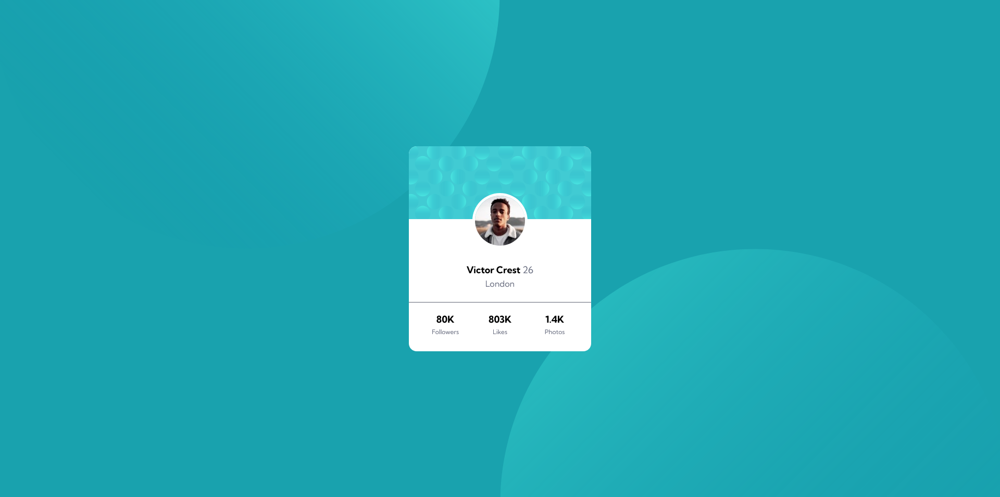

# Frontend Mentor - Profile card component solution

This is a solution to the [Profile card component challenge on Frontend Mentor](https://www.frontendmentor.io/challenges/profile-card-component-cfArpWshJ). Frontend Mentor challenges help you improve your coding skills by building realistic projects. 

## Table of contents

- [Overview](#overview)
  - [The challenge](#the-challenge)
  - [Screenshot](#screenshot)
  - [Links](#links)
- [My process](#my-process)
  - [Built with](#built-with)
  - [What I learned](#what-i-learned)
- [Author](#author)
- [Acknowledgments](#acknowledgments)

**Note: Delete this note and update the table of contents based on what sections you keep.**

## Overview

### The challenge

- Build out the project to the designs provided by Frontend Mentor. This is the design to be recreated:

### Screenshot

Screenshot of solution below:

### Links

- Solution URL: [Github repository](https://github.com/maxmirav/profile-card-component)
- Live Site URL: [Live site hosted on Vercel](https://profile-card-component-teal-mu.vercel.app/)

## My process

### Built with

- HTML 5
- CSS
- Flexbox

### What I learned

- I can position background elements using background-position, and then further fine-tune the final position by using right, left, bottom, center as well as vw and vh.
- Flexbox is very tricky, but always remember that it's just boxes inside boxes.

## Author

- Website - [Max Miravite](https://maxmirav.github.io/)
- Frontend Mentor - [@maxmirav](https://www.frontendmentor.io/profile/maxmirav)
- Twitter - [@MaxMiravite](https://www.twitter.com/MaxMiravite)

